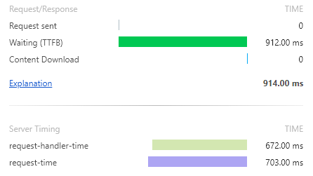

# Serpentine

Small IIS profiler for web requests using IHttpModule

## Installation

1. Download/Unzip latest [Release](https://github.com/gamingrobot/Serpentine/releases/latest)
2. Run `.\install-module.ps1` in PowerShell as Administrator
3. Look at the pretty metrics

## Features

- Measures Request/Handler Time
- Measures Response Size
- Adds metrics to html pages

- Adds metrics to headers

- Supports [Server-Timing](https://www.w3.org/TR/server-timing/) headers

## Limitations

- Metrics are per IIS Worker Process (Only an issue if you have changed `Maximum Worker Processes` in the AppPool settings)
- IIS Integrated Pipeline only

## Requirements

- IIS 7 or higher
- .NET Framework 4.6.2
